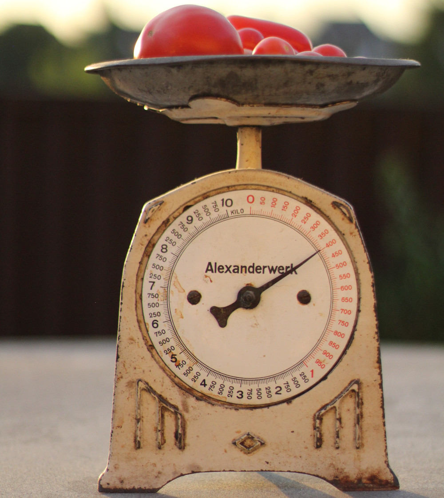

---
jupytext:
  formats: ipynb,md:myst
  text_representation:
    extension: .md
    format_name: myst
    format_version: 0.13
    jupytext_version: 1.10.3
kernelspec:
  display_name: Python 3
  language: python
  name: python3
---

+++ {"slideshow": {"slide_type": "slide"}}

# Bias-Variance, Regularization, Validation

[](https://mybinder.org/v2/git/https%3A%2F%2Fgitlab.in2p3.fr%2Fenergy4climate%2Fpublic%2Feducation%2Fmachine_learning_for_climate_and_energy/master?filepath=book%2Fnotebooks%2F2_bias_variance_regularization_validation.ipynb)

+++ {"slideshow": {"slide_type": "subslide"}}

<div class="alert alert-block alert-warning">
    <b>Prerequisites</b>
    
- [Elements of Probability Theory](appendix_elements_of_probability_theory.ipynb)  
- Define *supervized* and *unsupervized* learning
- Give the difference between *qualitative* and *quantitative* variables and define of *regression* and *classification*
</div>

+++ {"slideshow": {"slide_type": "subslide"}}

<div class="alert alert-block alert-info">
    <b>Learning Outcomes</b>
    
- Define a supervised learning problem
- Apply the methodology to a multiple linear regression
- Understand when and why a model does or does not generalize well on unseen data
</div>

+++ {"slideshow": {"slide_type": "slide"}}

## Supervised Learning Problem

+++ {"slideshow": {"slide_type": "subslide"}}

### Example: Home Heating

When its cold in my accomodation, I heat it.

$\rightarrow$ I suspect a relationship between the energy I consume to heat my accomodation and the outdoor temperature, although other factors may also play a role.

+++ {"slideshow": {"slide_type": "fragment"}}

How to predict how much energy I consume on average depending on the outdoor temperature ?

+++ {"slideshow": {"slide_type": "subslide"}}

Three different approaches:

- Process-based: use some approximation of the heat equation in my accomodation given heat sources (radiators) and sinks (outdoor).
- Expert-based: a thermal engineer diagnoses my accomodation based on his knowledge and/or on conventions.
- *Statistical*: use energy-consumption and outdoor-temperature data to estimate parameters of a model.

+++ {"slideshow": {"slide_type": "slide"}}

### Supervised Learning Objective

To define a supervised-learning problem we need:

- an *input* vector $X$ of $X_1, \ldots, X_p$ input variables, or *features* and
- an *output* or *target* variable $Y$ used for supervision.

+++ {"slideshow": {"slide_type": "fragment"}}

<hr>

**Supervised Learning Objective**
<br>
Construct the "best" prediction rule to predict $Y$ based on some *training data*: $(\boldsymbol{x}_i, y_i), i = 1, \ldots N$. 

<hr>

+++ {"slideshow": {"slide_type": "subslide"}}

The $i$th *observation* of $X_j$ in the *sample* is given by the element $x_{ij}$ of $N\times p$ *data matrix* $\boldsymbol{X}$.

| Regression | Classification |
| ------------------------------------- | --------------------------------------- |
| $Y$ is quantitative | $Y$ is qualitative |
|  |  |

```{code-cell} ipython3
---
slideshow:
  slide_type: skip
---
from pathlib import Path
import numpy as np
import pandas as pd
import hvplot.pandas
import panel as pn
pn.extension()

data_dir = Path('data')
kwargs_read_csv = dict(header=0, index_col=0, parse_dates=True)

FIRST_YEAR = 2014
LAST_YEAR = 2019
filename = 'surface_temperature_merra2_{}-{}.csv'.format(
    FIRST_YEAR, LAST_YEAR)
filepath = Path(data_dir, filename)
df_temp = pd.read_csv(filepath, **kwargs_read_csv).resample('D').mean()
label_temp = 'Temperature (°C)'

filename = 'reseaux_energies_demand_demand.csv'
filepath = Path(data_dir, filename)
df_dem = pd.read_csv(filepath, **kwargs_read_csv).resample('D').sum()
label_dem = 'Demand (MWh)'
```

```{code-cell} ipython3
---
slideshow:
  slide_type: skip
---
def scatter_temp_dem(region_name, year):
    df = pd.concat([df_temp[region_name], df_dem[region_name]],
                   axis='columns', ignore_index=True).loc[str(year)]
    df.columns = [label_temp, label_dem]
    return df.hvplot.scatter(x=label_temp, y=label_dem, width=500,
                             xlim=[-5, 30])

text = pn.pane.Markdown("""
## Generalizing vs. Memorizing
### New data will differ from training data.         
### Plus there is *noise* from unresolved factors.      
### -> we want to be able to *generalize*, not just *memorize*""")
```

```{code-cell} ipython3
---
slideshow:
  slide_type: subslide
---
pn.Row(pn.interact(scatter_temp_dem, region_name=df_dem.columns,
                   year=range(FIRST_YEAR, LAST_YEAR)),
       pn.Spacer(width=100), text)
```

+++ {"slideshow": {"slide_type": "subslide"}}

### Generalizing vs. Memorizing

New data will differ from training data.

Plus there is *noise* from unresolved factors.

$\rightarrow$ we want to be able to *generalize*, not just *memorize*

+++ {"slideshow": {"slide_type": "slide"}}

### Supervised Learning Problem Definition

Given the output $Y$,

- define inputs $X = (X_1, \ldots, X_p)$
- define model by a function $\mathcal{M}: X \mapsto \mathcal{M}(X)$
- define *loss function* $L(Y, \mathcal{M}(X))$
- choose a training set $(\boldsymbol{x}_i, y_i), i = 1, \ldots, N$

+++ {"slideshow": {"slide_type": "fragment"}}

Linear model: $\mathcal{M}_{\boldsymbol{\beta}}(X) = \beta_0 + \sum_{j = 1}^p X_j \beta_j$

Squared error loss: $L(Y, \mathcal{M}(X)) = \left(Y - \mathcal{M}(X)\right)^2$

+++ {"slideshow": {"slide_type": "subslide"}}

<div class="alert alert-block alert-warning">
We assume that all random variables and random vectors have finite variance and have densities (they are absolutely continuous with respect to the Lebesgue measure).
</div>

+++ {"slideshow": {"slide_type": "slide"}}

<hr>

**Expected Prediction Error**
<br>
\begin{equation}
\mathrm{EPE}(\mathcal{M}) = \mathbb{E}(L(Y, \mathcal{M}(X)))
= \int L(y, \mathcal{M}(x)) f_{X, Y}(x, y) dx dy.
\end{equation}

<hr>

<hr>

**Supervised Learning Objective (Concrete)**
<br>
Find $\mathcal{M}$ such that the EPE is minimized.

<hr>

+++ {"slideshow": {"slide_type": "subslide"}}

From the law of total expectation, we have that

\begin{align}
\mathrm{EPE}(\mathcal{M})
&= \mathbb{E}(\mathbb{E}[L(Y, \mathcal{M}(X)) | X])\\
&= \int L(y, \mathcal{M}(x)) f_{Y | X = x}(y) f_X(x)dy dx.
\end{align}

+++ {"slideshow": {"slide_type": "fragment"}}

The EPE can thus be interpreted as averaging over the inputs the prediction error for any input and can be minimized pointwise:

\begin{equation}
\mathcal{M}(x) = \mathrm{argmin}_c \mathbb{E}\left[L(Y, c) | X = x\right].
\end{equation}

+++ {"slideshow": {"slide_type": "subslide"}}

### The Case of Squared Error Loss

The EPE using the squared error loss is

\begin{equation}
\mathrm{EPE}(f) = \mathbb{E}((Y - f(X))^2).
\end{equation}

Then
\begin{equation}
\mathcal{M}(x) = \underset{c}{\mathrm{argmin}} \ \mathbb{E}\left[(Y - c)^2 | X = x\right].
\end{equation}

+++ {"slideshow": {"slide_type": "fragment"}}

Since the expectation is the value that minimizes the expectation of the squared deviations (see [Appendix: Elements of Probability Theory](appendix_elements_of_probability_theory.ipynb)), the optimal solution is 

\begin{equation}
\mathcal{M}(x) = \mathbb{E}(Y | X = x)
\end{equation}

+++ {"slideshow": {"slide_type": "subslide"}}

<div class="alert alert-block alert-info">
The best prediction of the output for any input is the conditional expectation, when best is measured by average squared error.
</div>

+++ {"slideshow": {"slide_type": "subslide"}}

> ***Question (Optional)***
> - What is the statistic giving the solution minimizing the EPE if we use the absolute error loss $|Y - f(X)|$ instead of the squared error loss?

+++ {"slideshow": {"slide_type": "slide"}}

## Bias-Variance Decomposition of the EPE

+++ {"slideshow": {"slide_type": "slide"}}

## Stationarity Assumption

+++ {"slideshow": {"slide_type": "slide"}}

## Law of Large Numbers ?

+++ {"slideshow": {"slide_type": "slide"}}

## References

- [Hastie, T., Tibshirani, R., Friedman, J., 2009. *The Elements of Statistical Learning*, 2nd ed. Springer, New York.](https://doi.org/10.1007/978-0-387-84858-7)

+++ {"slideshow": {"slide_type": "slide"}}

***
## Credit

[//]: # "This notebook is part of [E4C Interdisciplinary Center - Education](https://gitlab.in2p3.fr/energy4climate/public/education)."
Contributors include Bruno Deremble and Alexis Tantet.

<br>

<div style="display: flex; height: 70px">
    


    
</div>

<hr>

<div style="display: flex">
    <a rel="license" href="http://creativecommons.org/licenses/by-sa/4.0/"></a>
    <br>This work is licensed under a &nbsp; <a rel="license" href="http://creativecommons.org/licenses/by-sa/4.0/">Creative Commons Attribution-ShareAlike 4.0 International License</a>.
</div>
